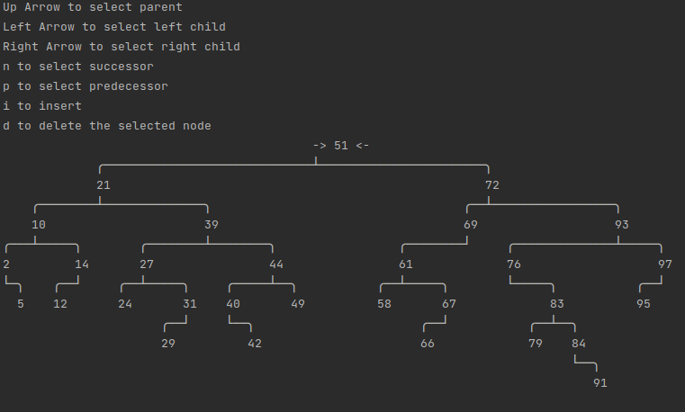

# About

Just a few snibbles and reimplementing some of the most popular data structures in Go.

## Data Structures

- [Binary Seach Tree (Generic)](pkg/bst)
- [Binary Seach Tree (Iterative)](pkg/bst2)
- [Hashmap](pkg/hashmap)
- [Heap](pkg/heap)
- [Linked List](pkg/linkedlist)
- [Queue](pkg/queue)
- [Stack](pkg/stack)

## Algorithms

- [Dijkstra's Algorithm](pkg/dijkstra)

## Games

________

### Binary Search Tree

`go run . bst`

#### Commands

```
up    - move up
left  - select left child
right - select right child
n     - in order successor
p     - in order predecessor
```



________
