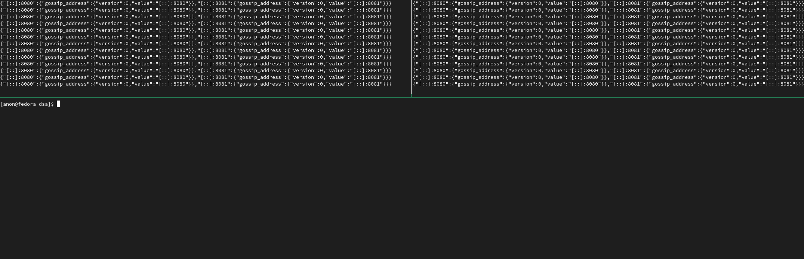

# About

Just a few bobs and snibbles. Implementing
some data structures, challenges and games in Go and stuff.

## Data Structures

- [Binary Seach Tree (Generic)](pkg/bst)
- [Binary Seach Tree (Iterative)](pkg/bst2)
- [Hashmap](pkg/hashmap)
- [Heap](pkg/heap)
- [Linked List](pkg/linkedlist)
- [Queue](pkg/queue)
- [Stack](pkg/stack)
- [Disjoint Set](pkg/disjointset)

## Algorithms

- [Dijkstra's Algorithm](pkg/dijkstra)
- [Kruskal's Algorithm](pkg/kruskal)
- [Prim's Algorithm](pkg/prim)
- [Bellman-Ford Algorithm](pkg/bellmanford)

# Challenges

- [Remove Islands](pkg/challenges/islands)

## Games and Stuff

### [Binary Search Tree](pkg/cmd/bstgame)

`go run . bst`

#### Commands

```
up    - move up
left  - select left child
right - select right child
n     - in order successor
p     - in order predecessor
i     - insert a node
d     - delete the selected node
```


### [Maze Generator](pkg/cmd/mazegen)

`go run . maze --width 10 --height 10`

#### Commands

```
press any key to generate a new maze
press escape to exit
```


### [Gossip Protocol](pkg/cmd/gossip)

This is a simple implementation of the [Gossip Protocol](https://en.wikipedia.org/wiki/Gossip_protocol).

This server accepts key-value pairs, and propagates the values throughout the cluster.

```
# First, start the gossip servers
go run . gossip --addr localhost:8080 
go run . gossip --addr localhost:8081 --seed localhost:8080

# Send new key pairs to the gossip servers
curl -i -X POST http://localhost:8081 -H "Content-Type: application/json" -d '{"a":"n"}'

# Observe the values being replicated
```



